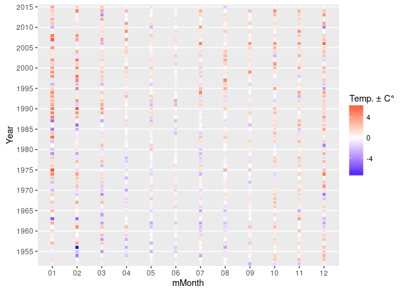

# Temperature fun in Hamburg
Christopher Floess  

Looking at data collected from the [DWD Weste site](http://www.dwd.de/DE/leistungen/weste/westexl/weste_xl.html?nn=342632)

```{R)
install.packages('weathermetrics')
install.packages('dplyr')
install.packages('ggplot2')
```


```r
# install.packages('weathermetrics')
library(weathermetrics)
library(dplyr)
```

```
## 
## Attaching package: 'dplyr'
```

```
## The following objects are masked from 'package:stats':
## 
##     filter, lag
```

```
## The following objects are masked from 'package:base':
## 
##     intersect, setdiff, setequal, union
```

```r
library(ggplot2)
```

## Read and combine the data

Four files with identical data structures over the past 40 years or so.


```r
dwd1 <- read.csv2("assets/weste_product_2016_08_28__09_58_19.csv")
dwd2 <- read.csv2("assets/weste_product_2016_08_28__10_05_34.csv")
dwd3 <- read.csv2("assets/weste_product_2016_08_28__10_09_10.csv")
dwd4 <- read.csv2("assets/weste_product_2016_08_28__10_13_44.csv")
dwd5 <- read.csv2("assets//weste_product_2016_09_25__08_06_59.csv")
dwdHamburg <- rbind(dwd1, dwd2, dwd3, dwd4, dwd5)
```

## Clean up the data


```r
str(dwdHamburg)
```

```
## 'data.frame':	46030 obs. of  12 variables:
##  $ Element          : Factor w/ 2 levels "Lufttemperatur Tagesmittel",..: 1 1 1 1 1 1 1 1 1 1 ...
##  $ Messstation      : Factor w/ 1 level "Hamburg-Fuhlsbüttel": 1 1 1 1 1 1 1 1 1 1 ...
##  $ Datum            : Factor w/ 23011 levels "2003-08-01","2003-08-02",..: 1 2 3 4 5 6 7 8 9 10 ...
##  $ Wert             : num  23.6 23.2 22.3 21.4 20.9 20.8 23.3 24.8 24.8 23.8 ...
##  $ Einheit          : Factor w/ 2 levels "%","Grad C": 2 2 2 2 2 2 2 2 2 2 ...
##  $ Geo.Breite..Grad.: num  53.6 53.6 53.6 53.6 53.6 ...
##  $ Geo.Länge..Grad. : num  9.99 9.99 9.99 9.99 9.99 ...
##  $ Höhe..m.         : int  11 11 11 11 11 11 11 11 11 11 ...
##  $ Sensorhöhe..m.   : Factor w/ 1 level "keine Daten vorhanden": 1 1 1 1 1 1 1 1 1 1 ...
##  $ Erstellungsdatum : Factor w/ 2 levels "2016-08-28","2016-09-25": 1 1 1 1 1 1 1 1 1 1 ...
##  $ Copyright        : Factor w/ 1 level "© Deutscher Wetterdienst 2016": 1 1 1 1 1 1 1 1 1 1 ...
##  $ X                : logi  NA NA NA NA NA NA ...
```

There are two types of data collected.


```r
levels(dwdHamburg$Element)
```

```
## [1] "Lufttemperatur Tagesmittel" "Relative Luftfeuchte"
```


"Datum" should be of type `Date`


```r
dwdHamburg$Datum <- as.Date(dwdHamburg$Datum)
```

Since we'll be working with monthly aggregates over years, let's add a "year" column and a "month" column that represents the year and month of each value


```r
dwdHamburg$mYear <- as.factor(format(dwdHamburg$Datum, format = "%Y"))
dwdHamburg$mYearMonth <- as.factor(format(dwdHamburg$Datum, format = "%Y-%m"))
dwdHamburg$mMonth <- as.factor(format(dwdHamburg$Datum, format = "%m"))
```

In the web interface, it looked like there were some gaps in the years. Specifically in the 1950s it looked like only even numbered years.


```r
levels(as.factor(format(dwdHamburg$Datum, format = "%Y")))
```

```
##  [1] "1952" "1953" "1954" "1955" "1956" "1957" "1958" "1959" "1960" "1961"
## [11] "1962" "1963" "1964" "1965" "1966" "1967" "1968" "1969" "1970" "1971"
## [21] "1972" "1973" "1974" "1975" "1976" "1977" "1978" "1979" "1980" "1981"
## [31] "1982" "1983" "1984" "1985" "1986" "1987" "1988" "1989" "1990" "1991"
## [41] "1992" "1993" "1994" "1995" "1996" "1997" "1998" "1999" "2000" "2001"
## [51] "2002" "2003" "2004" "2005" "2006" "2007" "2008" "2009" "2010" "2011"
## [61] "2012" "2013" "2014" "2015"
```

One more sanity check. The years should all have about the same number of days.


```r
dwdHamburg %>%
  group_by(mYear) %>%
  summarise(no_rows = length(mYear))
```

```
## # A tibble: 64 × 2
##     mYear no_rows
##    <fctr>   <int>
## 1    1952     306
## 2    1953     730
## 3    1954     730
## 4    1955     730
## 5    1956     732
## 6    1957     730
## 7    1958     730
## 8    1959     730
## 9    1960     732
## 10   1961     730
## # ... with 54 more rows
```

So, looks good. The first year is incomplete because we started in August, but with two factors 730 is the right amount of values for a normal year while 732 corresponds to a leap year.

## Average Temperature by year


```r
dwdTemps <- filter(dwdHamburg, Element == "Lufttemperatur Tagesmittel")
annualAverages <- aggregate(Wert~mYear, data = dwdTemps, FUN=mean, simplify = F)
annualAverages$Wert <- as.numeric(annualAverages$Wert)
g <- ggplot(data=annualAverages) +
  geom_point() +
  aes(x=mYear, y=Wert) +
  coord_fixed(ratio = 5) +
  scale_y_continuous(name = "Degrees C°") +
  scale_x_discrete(name = "Year",
                   breaks=seq(from=1950, to=2020, by=5)) +
  ggtitle("Average annual 1952-2015")
#g <- g + theme(plot.background=element_rect(fill="darkseagreen"))
g
```

<!-- -->

## Average by Month and Year


```r
dwdTemps <- filter(dwdHamburg, Element == "Lufttemperatur Tagesmittel")
monthlyAverages <- aggregate(Wert~mYear+mMonth, data = dwdTemps, FUN=mean, simplify = F)
monthlyAverages$Wert <- as.numeric(monthlyAverages$Wert)
mHistoricMonthlyAverage <- monthlyAverages[["mMonth"]]
```

We now take the historic monthly average for all of germany as taken from [wikipedia](https://de.wikipedia.org/wiki/Zeitreihe_der_Lufttemperatur_in_Deutschland#Durchschnittswerte_.C3.BCber_unterschiedliche_Zeitperioden) and compare it to the monthly averages recorded in Hamburg.

We do this by duplicating the `mMonth` column and assigning the
`historicMonthlyAverages` levels to this column. These levels are the
temperatures taken from the wikipedia page. We then convert the factor levels,
first to a `string`, and then to a `numeric` and add a new column for the difference of the recorded monthly average and the historic monthly average


```r
# taken from https://de.wikipedia.org/wiki/Zeitreihe_der_Lufttemperatur_in_Deutschland#Durchschnittswerte_.C3.BCber_unterschiedliche_Zeitperioden
historicMonthlyAverages <- c(-0.4, 0.3, 3.6, 7.7, 12.4, 15.5, 17.3, 16.6, 13.3, 8.6, 4.0, 0.9)

monthlyAverages <- cbind(monthlyAverages, mHistoricMonthlyAverage)

historicMonthlyAveragesFactor <- factor(historicMonthlyAverages)
levels(monthlyAverages$mHistoricMonthlyAverage) <- historicMonthlyAveragesFactor
monthlyAverages$mHistoricMonthlyAverage <- as.character(monthlyAverages$mHistoricMonthlyAverage)
monthlyAverages$mHistoricMonthlyAverage <- as.numeric(monthlyAverages$mHistoricMonthlyAverage)

deviationFromNormal <- -1*(monthlyAverages$mHistoricMonthlyAverage - monthlyAverages$Wert)
monthlyAverages <- cbind(monthlyAverages, deviationFromNormal)
```


```r
g <- ggplot(data=monthlyAverages) +
  scale_color_gradient2(low="blue", high="red", mid = "white", midpoint = 0) +
  geom_point(shape = 15) +
  aes(x=mMonth, y=mYear, color = deviationFromNormal) +
  scale_y_discrete(name = "Year",
                   breaks=seq(from=1950, to=2020, by=5)) +
  ggtitle("Monthly Average Temperature by Year")
g
```

<!-- -->

## Dewpoint by year


```r
dwdTemps <- filter(dwdHamburg, Element == "Lufttemperatur Tagesmittel")
dwdHumidity <- filter(dwdHamburg, Element == "Relative Luftfeuchte")
annualAverageTemps <- aggregate(Wert~mYear, data = dwdTemps, FUN=mean, simplify = F)
annualAverageTemps$Wert <- as.numeric(annualAverageTemps$Wert)
annualAverageTemps$Temp <- annualAverageTemps$Wert

annualAverageHumidities <- aggregate(Wert~mYear, data = dwdHumidity, FUN=mean, simplify = F)
annualAverageHumidities$Humidity <- as.numeric(annualAverageHumidities$Wert)
Humidity <- as.numeric(annualAverageHumidities$Wert)

annualAverageHumiditiesAndTemps <- cbind(annualAverageTemps, Humidity)

annualAverageHumiditiesAndTemps$dewPoint <- humidity.to.dewpoint(
  rh=annualAverageHumiditiesAndTemps$Humidity,
  t=annualAverageHumiditiesAndTemps$Temp,
  temperature.metric = "celsius")
g <- ggplot(data=annualAverageHumiditiesAndTemps) +
  geom_point() +
  aes(x=mYear, y=dewPoint) +
  coord_fixed(ratio = 5) +
  scale_y_continuous(name = "Dewpoint, Degrees C°") +
  scale_x_discrete(name = "Year",
                   breaks=seq(from=1950, to=2020, by=5)) +
  ggtitle("Average annual 1952-2015")
g
```

<!-- -->
